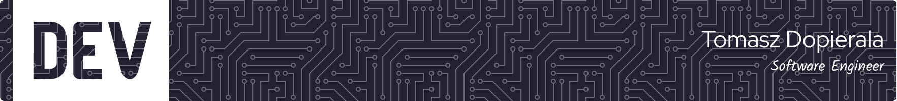

<!--  -->

<!--
## Hello there! I'm Tomasz 👋
- 🔭 I'm a full-time Software Developer with over 10 years of experience, working remotely since 2016 🚀
- 💬 You can ask me about: JavaScript, TypeScript, PHP, Bash, Linux
- 📫 You can reach me at Twitter ([@t_dopierala](https://twitter.com/t_dopierala)), and [LinkedIn](https://www.linkedin.com/in/dopierala/). 
- 🌱 I’m currently learning Python for one of my personal projects
- ⚡ Fun fact: I prefer to use tabs over spaces
-->

## Hello World! I'm Tomasz 👋

🚀 Setting sail on a coding odyssey since 2009, I've been shaping the digital world as a Full-time Software Developer for over 10 years. From the bustling tech landscapes to the tranquility of remote work since 2016, my journey has been nothing short of exhilarating.

💬 Dive into the realm of JavaScript, TypeScript, PHP, Bash scripting and Linux technologies with me – ask away, and let's unravel the intricacies of the coding cosmos together!

📫 Catch a glimpse of my coding escapades on Twitter ([@t_dopierala](https://twitter.com/t_dopierala)) and peek into my professional universe on [LinkedIn](https://www.linkedin.com/in/dopierala/). Let's connect and explore the vast possibilities of the coding galaxy.

⚙️ Throughout my professional journey, I've navigated the challenges of Adobe ColdFusion, .NET, and various relational database technologies, honing my skills in diverse tech realms.

⚡ Fun fact: While the world debates spaces vs. tabs, I've firmly pledged allegiance to the tabs camp – because, let's be honest, cleaner code is a thing of beauty! ✨ Let's code with style!
 

## My Skill Set  

  

 

  

  
 

## Connect with me  

 

## Github Stats  

<!--  -->

  

  
  
  

 
  

  

 

<!--

-->

   

  

 
 

<!--
**tdopierala/tdopierala** is a ✨ _special_ ✨ repository because its `README.md` (this file) appears on your GitHub profile.

Here are some ideas to get you started:

- 🔭 I’m currently working on ...
- 🌱 I’m currently learning ...
- 👯 I’m looking to collaborate on ...
- 🤔 I’m looking for help with ...
- 💬 Ask me about ...
- 📫 How to reach me: ...
- 😄 Pronouns: ...
- ⚡ Fun fact: ...
-->

